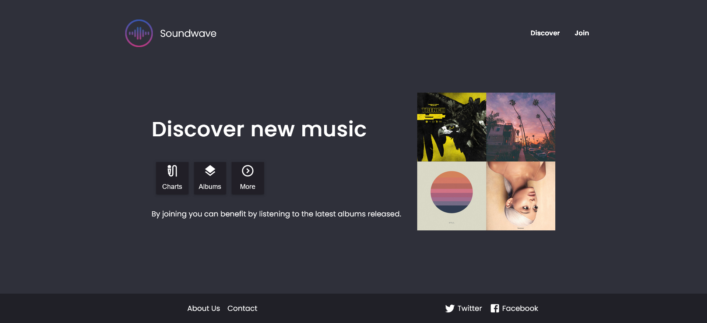
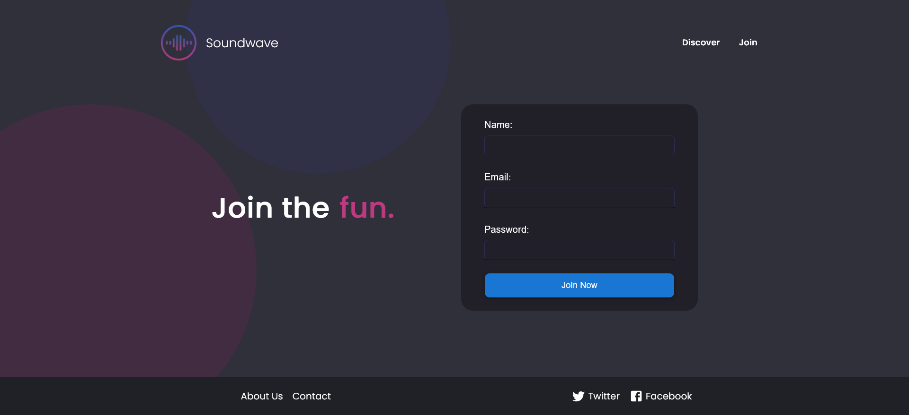

# :notes::atom_symbol: SoundWave 
Individual project to learn the basics of React: creation of an app called 'Soundwave' that resembles the provided mockup as closely as possible. 

  
## :pencil2: Resources
- Mockup: <a href="https://simplonline-v3-prod.s3.eu-west-3.amazonaws.com/media/file/pdf/46391d6c-b766-4ed3-a121-72c9b2a15960.pdf">
    click here  </a>
 - Style guide: <a href="https://simplonline-v3-prod.s3.eu-west-3.amazonaws.com/media/file/pdf/46391d6c-b766-4ed3-a121-72c9b2a15960.pdf">
    click here  </a>
- Material-UI: <a href="https://simplonline-v3-prod.s3.eu-west-3.amazonaws.com/media/file/pdf/46391d6c-b766-4ed3-a121-72c9b2a15960.pdf">
  click here </a>

## :triangular_flag_on_post: App

- Link Vercel

## :woman_technologist: Learnings

- Getting started with **Create React App** and **Vite** build tool
- Creating routes with **React Router**
- Creating **functional components**
- JavaScript functionalities: ES6 arrow functions, array mapping, object destructuring, and template literals.
- Organizaing the **components** and **pages** with **Atomic Design** principles
- Using **TypeScript JSX** 
- Implementing **Material-UI** and **CSS modules** 
- Enabling **responsive** CSS

## :hammer_and_wrench: Languages and Tools

  &nbsp;
  &nbsp;
  &nbsp;
  &nbsp;
  &nbsp;
  

